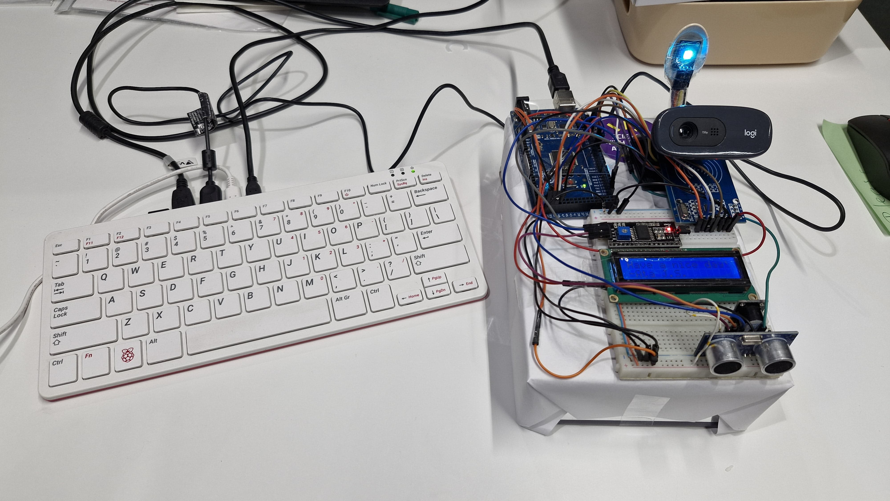
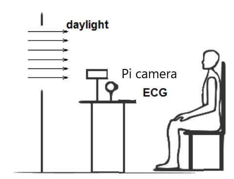
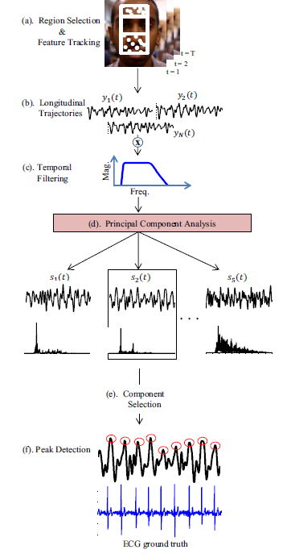
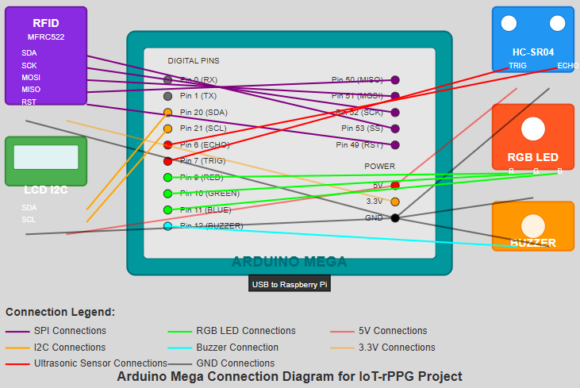

# IoT-Integrated Remote Photoplethysmography System

## Project Overview
This repository contains the implementation of a contactless heart rate monitoring system that integrates Internet of Things (IoT) technologies with remote photoplethysmography (rPPG). The system uses three interconnected devices (PC, Raspberry Pi 400, and Arduino Mega) to create a complete measurement platform with user verification and environmental control capabilities.



## Demo
View the project demonstration on YouTube: [[Demo Video Link](https://www.youtube.com/watch?v=oNUWJu3g3D4&si=TzuRgFtludmjtAAG)]

## System Architecture
The project implements a master-slave architecture:

- **Master Device**: PC/Laptop running Python
- **Slave Device**: Raspberry Pi 400 running Python
- **Auxiliary Control**: Arduino Mega (compensating for Raspberry Pi GPIO limitations)
- **Sensors/Components**: 
  - USB Camera (connected to Raspberry Pi)
  - RFID Reader (MFRC522)
  - LCD Display (I2C Interface)
  - Ultrasonic Distance Sensor (HC-SR04)
  - RGB LED
  - Buzzer

## Features
- Non-contact heart rate measurement using camera-based rPPG
- User authentication via RFID
- Automated distance verification for optimal measurement conditions
- Real-time data transmission between devices
- User guidance through LCD display and visual/audio cues
- Real-time heart rate visualization and statistics
- Data logging to CSV for further analysis

## Technical Implementation

### Communication Protocols
- TCP/IP Socket Communication between PC and Raspberry Pi
- Serial Communication between Raspberry Pi and Arduino Mega
- SPI Communication between Arduino and RFID Reader
- I2C Communication between Arduino and LCD Display

### rPPG Algorithm
The heart rate measurement uses a computer vision approach:
1. Face detection using Haar cascades
2. ROI (Region of Interest) extraction
3. RGB signal extraction from facial regions
4. Signal processing using FastICA
5. Frequency analysis using FFT
6. Heart rate calculation from dominant frequency



### Process Flow
1. PC initiates the measurement by sending a start signal to Raspberry Pi
2. Raspberry Pi instructs Arduino to prepare the environment
3. Arduino verifies user identity and distance, providing guidance via LCD
4. Upon completion, Arduino signals Raspberry Pi to begin rPPG measurement
5. Raspberry Pi performs heart rate analysis and streams data to PC
6. PC visualizes and stores the received heart rate data

## Repository Contents
- `pc_comm_final.py`: Master node script for PC
- `final_rppg_pi.py`: Slave node script for Raspberry Pi
- `arduino_mega_code.ino`: Arduino code for user verification and environment setup
- `haarcascade_frontalface_default.xml`: Required for face detection
- `docs/`: Additional documentation and project report
- `images/`: Setup photographs and diagrams

## Hardware Setup




## Requirements

### PC Requirements
- Python 3.x
- Libraries: socket, csv, time, matplotlib, datetime

### Raspberry Pi Requirements
- Raspberry Pi 400 (or similar)
- Python 3.x
- Libraries: socket, serial, cv2, numpy, scipy, sklearn, matplotlib
- Connected USB camera

### Arduino Requirements
- Arduino Mega
- Libraries: SPI, MFRC522, Wire, LiquidCrystal_I2C
- Connected components: RFID reader, LCD display, ultrasonic sensor, buzzer, RGB LED

## Installation and Setup

1. Clone this repository:
   ```
   git clone https://github.com/username/iot-rppg-system.git
   cd iot-rppg-system
   ```

2. Set up Arduino:
   - Connect components according to pin configuration in code
   - Install required libraries through Arduino IDE
   - Upload `arduino_mega_code.ino` to Arduino Mega

3. Set up Raspberry Pi:
   - Install required Python packages:
     ```
     pip install numpy scipy opencv-python scikit-learn matplotlib pyserial
     ```
   - Ensure the USB camera is connected
   - Update IP addresses in `final_rppg_pi.py` to match your network configuration

4. Set up PC:
   - Install required Python packages:
     ```
     pip install matplotlib
     ```
   - Update IP addresses in `pc_comm_final.py` to match your network configuration

## Usage

1. Connect all devices to the same network
2. Start the slave process on Raspberry Pi:
   ```
   python final_rppg_pi.py
   ```
3. Start the master process on PC:
   ```
   python pc_comm_final.py
   ```
4. Follow the instructions displayed on the LCD screen
5. Remain still during the measurement process
6. View real-time heart rate data on the PC terminal
7. After 30 seconds, a graph will be displayed and data saved to CSV

## Limitations
This project is a creative integration of IoT with rPPG technology and serves primarily as an educational demonstration. The rPPG implementation is basic and has several limitations:
- Sensitivity to lighting conditions
- Dependence on subject stillness
- Limited accuracy compared to contact methods
- Not suitable for clinical applications

More advanced rPPG approaches (such as Skin-Subtraction Learning and deep learning methods) would be required for robust heart rate measurements.

## Credits
This project was developed by Ata Jodeiri Seyedian at the University of Oulu for Dr. Christian Schuss's Wireless Measurements Project Course.

The rPPG implementation is based on the [HeartPi project](https://github.com/ganeshkumartk/heartpi).

## License
MIT License
